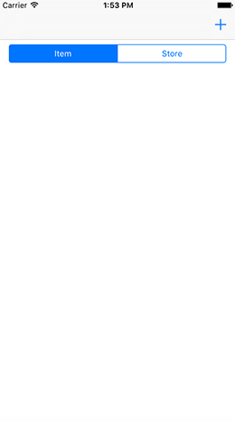
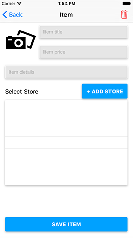
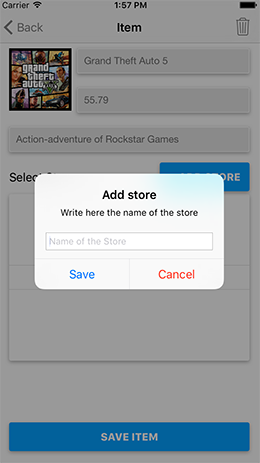
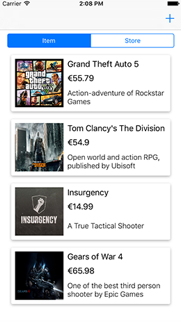
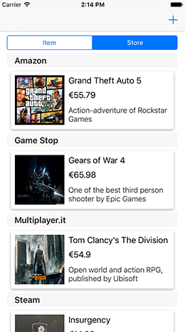

<h1>GameList-in-CoreData</h1>
My study of an app created to save Items and new Stores with CoreData. 

The programming language is Swift.

<h5>Inside the repo: </h5>
 - CoreData
 - AutoLayout
 - Custom TextFields
 
<h5>Some screenshots:</h5>
 
 
 
 
 
